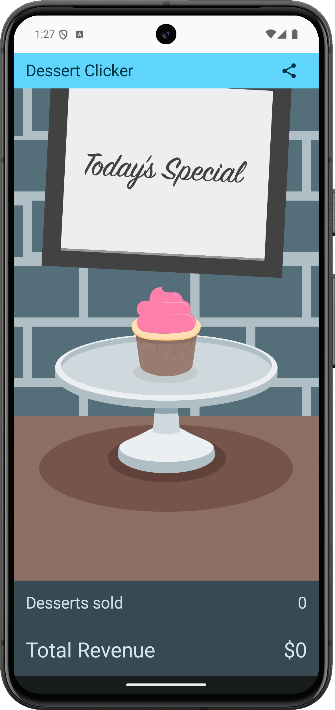
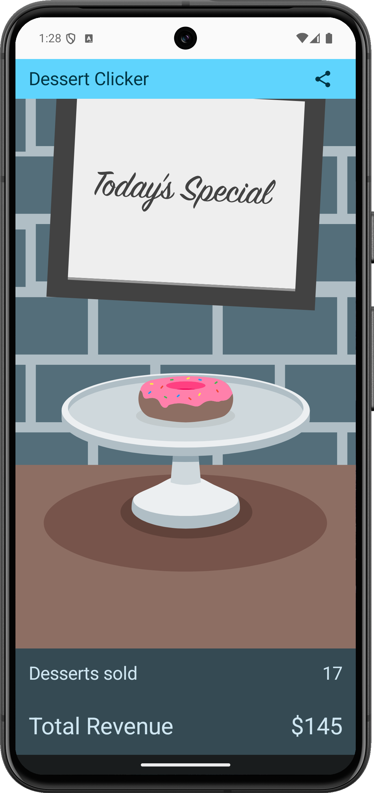
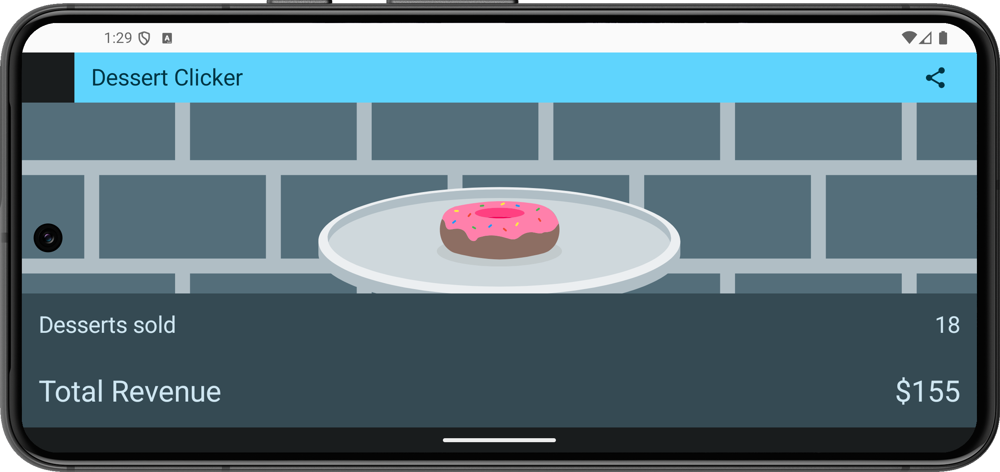

Dessert Clicker app
=====================

Code for Android Basics with Compose Codelab.

Introduction
------------

Dessert Clicker is a game about making desserts.

Press the button, make a dessert, earn the big bucks.

You use this app in the course to explore the Android lifecycle and log messages to
the Android console (Logcat).

Screenshots of the Dessert Clicker App project
--- 
#### Using rememberSaveable 

 

 

Pre-requisites
--------------

You need to know:
- How to open, build, and run apps with Android Studio.
- What an activity is, and how to create one in your app.
- What the activity's onCreate() method does, and the kind of operations
  that are performed in that method.

Getting Started
---------------

1. Download and run the app.
